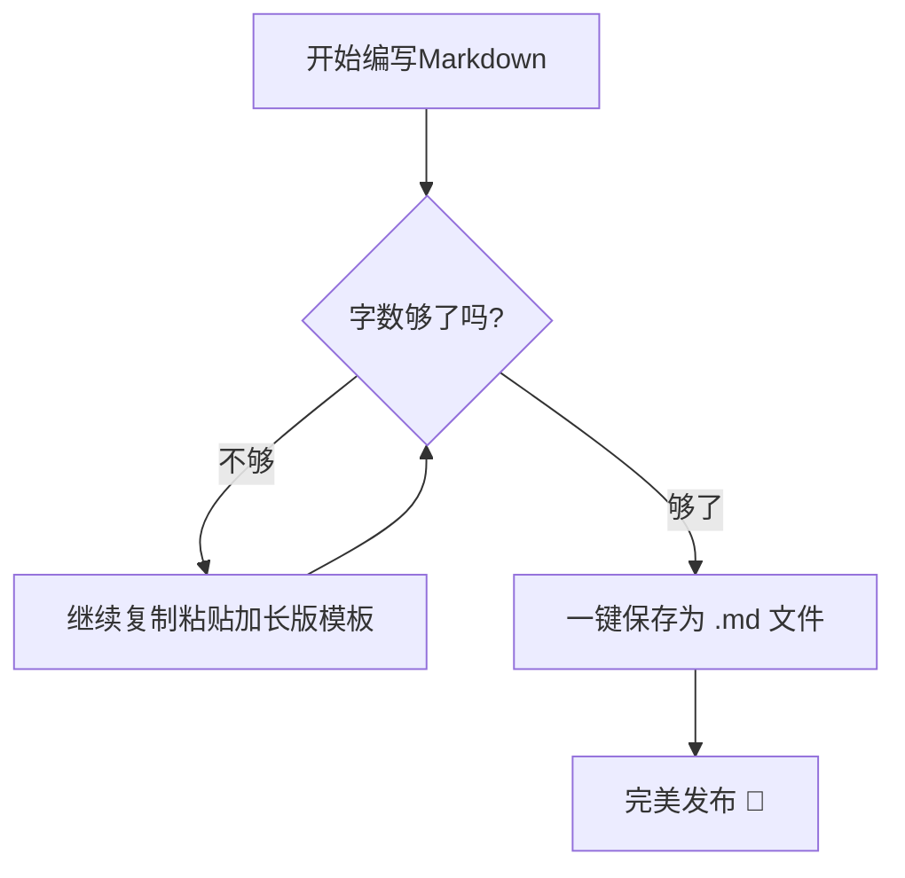

# 🚀 终极全功能 Markdown 语法大传（一级标题）

> **导语**：这是一份为您精心定制的 Markdown 全元素排版样板。它不仅涵盖了基础的文本样式，还包含了进阶的矩阵公式、HTML 混合排版、各种图表扩展以及一些冷门但实用的标签。您可以直接将其作为模板复制，应用到您的博客、文档或笔记中。

---

## 📅 一、 基础文本与排版样式

### 1.1 文本样式与强调
在日常写作中，你可能需要对文字进行各种样式的修饰：
*   **强壮的粗体**：使用双星号 `**加粗文本**` 或者是双下划线 `__加粗文本__`。
*   *优雅的斜体*：使用单星号 `*斜体文本*` 或者是单下划线 `_斜体文本_`。
*   ***耀眼的粗斜体***：使用三星号 `***粗斜体***`。
*   ~~划掉的删除线~~：使用双波浪线 `~~删除线~~` 表达过时或错误的观点。
*   下划线效果：Markdown 本身不带下划线，但我们可以请出 HTML 兄弟：`<u>带有下划线的文本</u>` 变成 <u>带有下划线的文本</u>。
*   高亮文本：部分高级编辑器支持双等号 `==高亮标记==` 带来类似荧光笔的效果。

### 1.2 段落、换行与分隔线
如果你只想换行而不是分段，请在行尾按下**两个空格然后回车**，或者使用 `<br>` 标签。<br>当前行与下一行就成了紧凑的换行关系。

如果你想彻底划分章节，可以使用三个以上的星号、减号或底线来建立一条华丽的分隔线：

***

---

___

### 1.3 脚注与特殊引用
有时候你需要在文章末尾补充名词解释，这时候**脚注**就派上用场了：
*   这是一个关于人工智能[^1]的讨论。
*   这是另一个关于区块链[^2]的术语。

*(注：脚注的详细内容会自动生成在文章的最底部，你可以点击序号直接跳转)*

---

## 📊 二、 结构化数据：列表、表格与定义

### 2.1 无序列表（嵌套三级）
*   🌲 外部环境
    *   🌱 植物群落
        *   🍀 苔藓与地衣
        *   🌿 蕨类植物
    *   🍄 真菌群落
*   🌊 水生生态

### 2.2 有序列表（复合嵌套）
1.  **准备阶段**
    1.  环境配置（安装 Node.js 与 Git）
    2.  依赖下载（执行 `npm install`）
2.  **开发阶段**
    *   编写核心业务逻辑
    *   编写单元测试用例
3.  **部署阶段**

### 2.3 任务列表（待办清单）
- [x] 🛒 购买本周所需的蔬菜与水果
- [x] 📖 阅读《重构》第三章节
- [ ] 🏋️‍♂️ 完成 30 分钟无氧核心训练
- [ ] 🛑 别忘了晚上给汽车加油

### 2.4 进阶定义列表（Definition List）
某些特定编辑器（如 Typora/Mdown）支持定义列表语法：
Markdown
: 一种轻量级的标记语言。
HTML
: 超文本标记语言，网页的基石。

### 2.5 复杂对齐表格
我们可以通过冒号 `:` 的位置，自由控制表格中每一列的对齐方式：

| 商品名称 (左对齐) | 商品编号 (居中) | 库存数量 (右对齐) | 备注说明 (默认) |
| :--- | :---: | ---: | --- |
| 💻 生产力御用笔记本 | PRO-2026-X1 | 42 | 限量附赠内胆包 |
| 🎧 主动降噪蓝牙耳机 | AUDIO-NC-09 | 1,205 | 畅销爆款，顺丰包邮 |
| ⌨️ 75% 配列机械键盘 | KEY-MECH-75 | 0 | 缺货，预计下周补货 |
| ☕ 深度烘焙咖啡豆 (1kg) | COFFEE-DARK | 890 | 产地埃塞俄比亚 |

---

## 💻 三、 代码展示与技术排版

### 3.1 行内代码与键盘输入
在一句话中插入技术术语时，使用反引号。例如：请在终端输入 `npm run dev` 来启动本地服务器。
如果你想表现键盘物理按键，可以使用 HTML 的 `<kbd>` 标签：请按下 <kbd>Ctrl</kbd> + <kbd>Shift</kbd> + <kbd>R</kbd> 进行强制刷新。

### 3.2 带有行号与语法高亮的代码块
标准的 Markdown 支持为各种主流编程语言提供绚丽的语法高亮：

```python
# 这是一个 Python 异步爬虫的简单伪代码示例
import asyncio

async def fetch_data(url):
    print(f"📡 正在请求: {url}")
    await asyncio.sleep(1)  # 模拟网络延迟
    return {"status": 200, "data": "Hello Markdown!"}

async def main():
    urls = ["[https://api.example.com/v1](https://api.example.com/v1)", "[https://api.example.com/v2](https://api.example.com/v2)"]
    tasks = [fetch_data(url) for url in urls]
    results = await asyncio.gather(*tasks)
    for res in results:
        print(f"✅ 收到响应: {res}")

if __name__ == "__main__":
    asyncio.run(main())

```

```sql
-- 这是一个标准的 SQL 查询示例
SELECT 
    user_id, 
    COUNT(order_id) AS total_orders, 
    SUM(price) AS total_spent
FROM orders
WHERE order_date >= '2026-01-01'
GROUP BY user_id
HAVING total_spent > 500
ORDER BY total_spent DESC;

```

---

## 🎨 四、 富媒体、超链接与自定义锚点

### 4.1 各种链接形式

* **普通文本链接**：[点击前往 Markdown 官方教程](https://markdown.com.cn)
* **带标题悬停的链接**：[把鼠标放上来试试](https://example.com)
* **自动链接**：直接写出 URL 也会被识别，例如：https://www.wikipedia.org

### 4.2 自定义页内锚点跳转

你可以在文章的任何地方安置一个隐形锚点：
（这里是一个隐形锚点）
[🔗 点击这里可以瞬间传送回文章顶部](#🚀-终极全功能 Markdown 语法大传（一级标题）)

### 4.3 图片嵌入（基础与带链接）

标准的图片语法：``

**进阶：给图片加上超链接**（点击下方图片将跳转到 Unsplash 官网）：
[](https://unsplash.com)

---

## 📐 五、 进阶：数学公式 (LaTeX) 与特殊符号

当您编写学术报告、算法推导或者统计学笔记时，Markdown 的 LaTeX 扩展是必不可少的。

### 5.1 行内数学公式

我们将公式嵌在句子中。例如，著名的麦克斯韦方程组中的高斯定律可以表示为 $\nabla \cdot \mathbf{E} = \frac{\rho}{\varepsilon_0}$，而勾股定理则是大家耳熟能详的 $a^2 + b^2 = c^2$。

### 5.2 独立块级公式

如果公式非常复杂，应当让它独占一行并居中放大展示：

$$\int_{a}^{b} f(x) \, dx = F(b) - F(a)$$

再来一个复杂的矩阵与极限公式组合：

$$A = \begin{pmatrix} 1 & x & x^2 \\ 1 & y & y^2 \\ 1 & z & z^2 \end{pmatrix}, \quad \lim_{n \to \infty} \left(1 + \frac{1}{n}\right)^n = e$$

### 5.3 常用特殊符号直接输入

* 版权所有：©
* 注册商标：®
* 人民币/日元：¥
* 加减号：±

---

## 🛠️ 六、 HTML 高级排版兼容

Markdown 与 HTML 完美兼容，这让我们可以突破原生语法的限制，做出更精致的排版。

### 6.1 文本颜色、大小与字体变幻

我们可以利用 `<font>` 标签或者内联样式 `style` 来自由定制：

* 我是 激情如火的红色文字。
* 我是 大号、蓝色、微软雅黑字体 的文字。
* 使用 Span 标签：粉色果冻质感的文字块

### 6.2 文本对齐方式

### 6.3 交互式折叠面板 (Accordion)

非常适合用来隐藏长代码、参考答案或者次要的背景补充信息：

### 恭喜你发现了隐藏宝藏！

这里面可以塞进任何你想塞的东西：

1. 比如一个无序列表
2. 或者一段行内代码 `git commit -m "feat: core"`
3. 甚至是一张图片！

---

## 📐 七、 现代 Markdown 扩展：Mermaid 流程图 (可选)

*(注：需要您的编辑器或渲染器支持 Mermaid 插件，如 GitHub, Notion, Typora 等)*



---

[^1]: 人工智能（Artificial Intelligence）：英语缩写为 AI。它是研究、开发用于模拟、延伸和扩展人的智能的理论、方法、技术及应用系统的一门新的技术科学。
[^2]: 区块链（Blockchain）：分布式数据存储、点对点传输、共识机制、加密算法等计算机技术的新型应用模式。

```